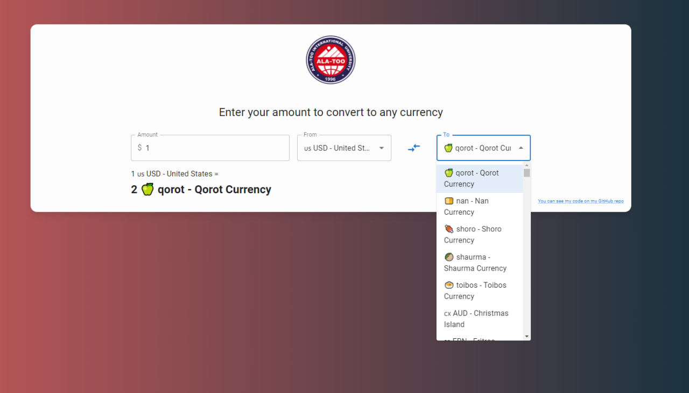
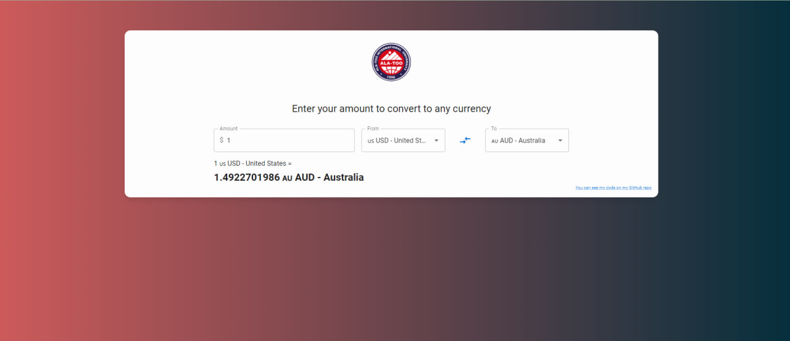
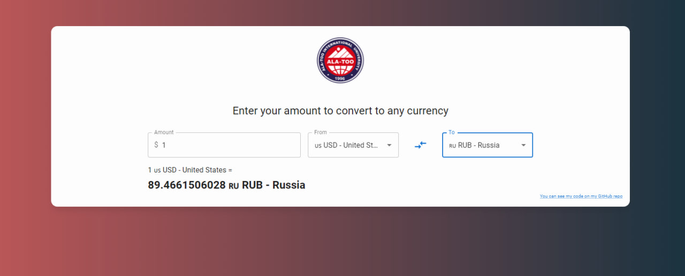
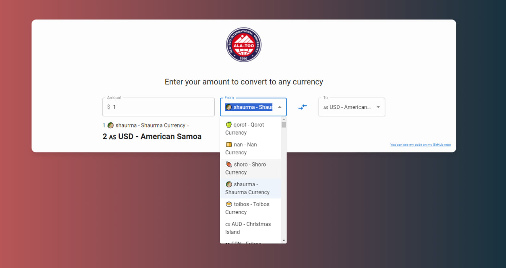
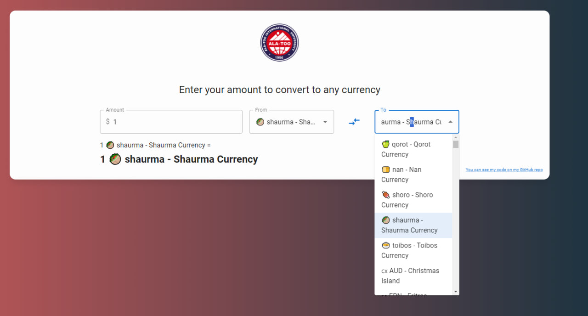
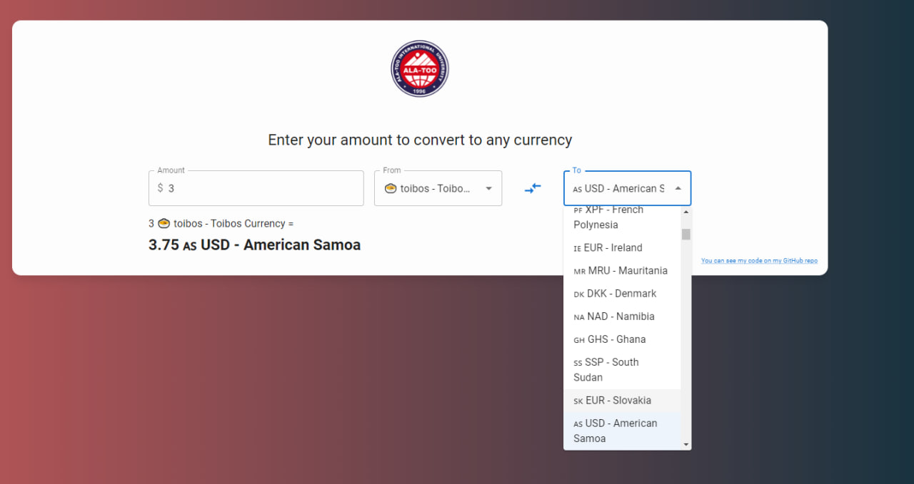

# Currency Converter to with additional converter to App

This Currency Converter App allows users to convert between various currencies including qorot, nan, shoro, shaurman, and toibos.

## Youtube
[Youtube ](https://youtu.be/uP2JyMGW2Uo?si=HNoMblfteXHKMzMU)

## Features

- **Currency Conversion:** Convert between different currencies based on the provided exchange rates.
- **Autocomplete Selection:** Easy selection of currencies with autocomplete suggestions.

## Technologies Used

- React.js
- Material-UI
- Axios

## Usage

### Installation

1. Clone the repository:

   ```bash
   git clone https://github.com/AkzholS7/finalFrontend2023

   cd finalFrontend2023

   npm install

   npm start dev or npm run dev

### Link to my App:
[My_project: ](https://suborov.s3.eu-north-1.amazonaws.com/index.html)

## Screenshots








